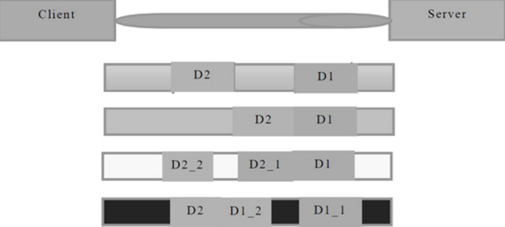

# 基于Unity的多人网络斗地主

# 服务器开发

服务器：

+ 接收请求
+ 发送数据
+ 接收数据
+ 断开连接

无论是服务器还是客户端，调用的都是客户端socket的接收和发送方法

客户端连接池：重用客户端连接对象

## 服务器底层

Socket说到底就是自己有一个缓冲区

开发服务器底层时自己定义SocketPeer和ClientPeer 后者是位于服务器的客户端连接对象（用于将一些方法封装给客户端连接对象自己），与之后在unity封装的客户端连接对象不同。

### 粘包拆包问题

[(57条消息) TCP粘包和拆包原因_怀素的专栏-CSDN博客](https://blog.csdn.net/huaishu/article/details/50041169)

#### 问题产生

一个完整的业务可能会被TCP拆分成多个包进行发送，也有可能把多个小的包封装成一个大的数据包发送，这个就是TCP的拆包和封包问题。



1. 第一种情况，Data1和Data2都分开发送到了Server端，没有产生粘包和拆包的情况。

2. 第二种情况，Data1和Data2数据粘在了一起，打成了一个大的包发送到Server端，这个情况就是粘包。

3. 第三种情况，Data2被分离成Data2_1和Data2_2，并且Data2_1在Data1之前到达了服务端，这种情况就产生了拆包。

由于网络的复杂性，可能数据会被分离成N多个复杂的拆包/粘包的情况，所以在做TCP服务器的时候就需要首先解决拆包/粘包的问题。

#### TCP粘包和拆包的解决策略

1. 消息定长，例如100字节
2. 在包尾部增加回车或者空格符等特殊字符进行分割，典型的如FTP协议
3. **将消息分为消息头和消息尾**（本项目采用的方法）
4. 其他复杂的协议，如RTMP协议等

**消息头和消息尾**

构造

> 头：消息的长度 bt.length int  4个字节
>
> 尾：具体的消息 bt

读取

首先读4个字节获取消息长度，然后读消息长度这么长的数据转成对应的object

```c#
public static byte[] DecodePacket(ref List<byte> dataCache)
        {
            //四个字节构成一个int长度 不能构成一个完整的消息
            if (dataCache.Count < 4)
                return null;
                //throw new Exception("数据缓存长度不组4 不能构成一个完整的消息")；
            //内存流对象 可以理解为字节数组的数组
            using (MemoryStream ms = new MemoryStream(dataCache.ToArray()))
            {
                using (BinaryReader br = new BinaryReader(ms))
                {
                    int length = br.ReadInt32();
                    int dataRemainLength = (int)(ms.Length - ms.Position);

                    if(length > dataRemainLength)
                        return null;
                    //throw new Exception("数据长度不够包头约定的长度 不能构成一个完整的消息")；

                    byte[] data = br.ReadBytes(length);
                    //更新一下数据缓存
                    //先清空  之后将剩余的数据写回数据缓冲区
                    dataCache.Clear();
                    dataCache.AddRange(br.ReadBytes(dataRemainLength));

                    return data;
                }
            }
        }
```

这里定义消息头+消息尾是packet 也就是数据包，真正的数据起名为data

### SocketMsg

```c#
		/// <summary>
        /// 操作码
        /// </summary>
        public int OpCode { get; set; }
        /// <summary>
        /// 子操作
        /// </summary>
        public int SubCode { get; set; }
        /// <summary>
        /// 参数
        /// </summary>
        public object Value { get; set; }
```

#### SocketMsg与byte[]的转化

就是将opcode subcode value依次转成byte[]

解析的时候也是按顺序读取，要注意value==null的情况就不用读value了

**流程是socketMsg->字节数组byte[]（通过序列化）->标准数据包（添加包头包尾）**

### 对象的序列化和反序列化

用的是C#内置的序列化

### 发送的消息队列

接收是加入**数据缓存**（` List<Byte> dataCache`）中无限的递归处理数据


存入发送的消息队列中 利用尾递归方法 来取出消息队列中的数据 设置到发送的异步套接字操作的发送数据缓冲区

```c#
//设置 消息发送异步对象 的发送数据缓冲区
SendArgs.SetBuffer(packet, 0, packet.Length);
bool result = ClientSocket.SendAsync(SendArgs);
if(result == false)
{ 
    processSend();
}
```

讲解思路：协议定义（SocketMsg到Packet转化），接收数据，发送数据


接收数据的时候流程：

从datacache取出数据->层层解包得到SocketMsg->存储进消息队列等待处理

### 抽象应用层

编写的游戏服务器扩展性强，可以应用于例如卡牌、竞技、rpg等不同类型的游戏，应用层是不固定的，所以抽象成一个接口。

### 工具类

#### 线程安全的INT ConcurrentInt

lock无法锁int但可以锁对象，因此定义成一个新的类

```c#
public class ConcurrentInt
    {
        private int value;

        public ConcurrentInt(int _value)
        {
            this.value = _value;
        }
        /// <summary>
        /// 添加并获取
        /// </summary>
        /// <returns></returns>
        public int Add_Get()
        {
            lock (this)
            {
                value++;
                return value;
            }
        }
        /// <summary>
        /// 减少并获取
        /// </summary>
        /// <returns></returns>
        public int Reduce_Get()
        {
            lock (this)
            {
                value--;
                return value;
            }
        }

        public int Get()
        {
            return value;
        }
    }
```

#### 单线程池

互斥锁：用于保证共享数据操作的完整性，任一时刻只能有一个线程来访问该对象

## 开发具体斗地主服务器

网络消息中心

作用：对网络消息进行分类，转发（只是转发不做处理，处理操作交给具体的模块去做）

模块有：账号模块...

### 斗地主服务器架构

由上到下依次为

>网络消息中心NetMsgCenter
>
>逻辑层（撰写业务逻辑）
>
>数据层（缓存层或者是数据库，也就是数据持久化的内容）
>
>模型层（Domain）

关于网络消息中心如何分发消息：

消息协议的指定OpCode SubCode Value

利用OpCode来分发到不同的模块 OpCode Subcode存在服务器和客户端共用的Protocol协议中

Subcode是分发到不同模块后的具体操作例如Account中的REGIST_CREQ REGIST_SRES LOGIN等具体的业务

### 客户端接收消息的处理

```java
HandlerBase  accountHandler = new AccountHandler();
//接收网络的消息
private void processSocketMsg(SocketMsg msg){
    switch(msg.OpCode){
        case OpCode.ACCOUNT:
            accountHandler.OnReceive(msg.subCode,msg.Value);
            break;
        default:
            break;
    }
}
```

HandlerBase是虚类，里面定义了OnReceive的方法，之后不同的子类继承这个基类后可以实现自身的OnReceive的方法，OnReceive是针对subCode以及Value值做进一步的业务逻辑

```java
public class AccountHandler:HanderBase{
    public overrider void OnReceive(int subCode, object value){
        switch(subCode){
            case AccountCode.REGIST_SRES:
                //执行一些注册的操作
                break;
        }
    }
}
```

看到了72


# 基于消息机制的Unity框架（发布订阅模式）

在开发游戏时，模块之间的交互频繁，为了进一步降低两个模块之间的耦合性，开发了一个基于消息机制的Unity框架。

**为了解耦合**

UI界面到3D物体的访问就要做到一个消息的传递

发送消息时，发送到对应模块/eventcode/message

具体接收消息的模块根据eventcode事件码来决定需要执行的具体操作

中间的消息处理中心用的是单例模式

## 整体架构

> + Framework 
>   + MonoBase 在MonoBehavior的基础上创造了虚函数Execute
>   + ManagerBase 各个模块Manager的基类 用于保存自身注册的一系列消息（之后的模块Manager是单例）
>   + **MsgCenter** 消息处理中心 仅仅是负责消息的转发
>   + AreaCode 区域码 里面存了各个模块的代码 根据区域码将消息转发到对应的区域

> + 具体的模块文件夹如UI
>   + **UIBase** 该模块中具体的小单元b的基类 **继承自MonoBase**
>   + **UIManager** **继承自ManagerBase** 添加单例模式
>   + UIEvent 存储了这个模块的一些操作码

主要就是上述三个加粗的部分在交互

以UI模块发送消息 Audio模块接收为例：

> 具体的UI单一Dispatch这个消息会首先来到MsgCenter，MsgCenter再分发到对应的模块Manager中，这里具体就应该是AudioManager，之后由于具体的Audio单元Bind了这个事件，已经将自己和EventCode加入到AudioManage的字典中，因此当上述流程执行到AudioManager中，它会给所有注册了这个事件的脚本发过去，本质就是调用这个脚本的Execute函数，这个 函数就是我们具体写在具体的Audio单元中的Execute事件，至此整个流程结束。

## 一些小知识点

### Dispatch

```c#
public void Dispatch(int areaCode,int eventCode,object message){
    switch(areaCode){
        case AreaCode.AUDIO:
            break;
        case AreaCode.CHARACTER:
            break;
        case AreaCode.NET:
            break;
        case AreaCode.GAME:
            break;
    }
}

第一个参数是识别到角色模块，第二个参数代表具体的事件，比如角色模块可能有移动 攻击 死亡 等 动作
第二个参数就是来识别具体是哪一个动作
```

### ManagerBase中的Dictionary<int,List<MonoBase>>

这个是存储消息的事件码和哪个脚本关联的字典

为何后面是具体单元的List？（一对多的形式）

角色模块有一个动作是移动

移动模块 需要关心这个事件 来控制角色位置的移动

动画模块 需要关心这个事件 控制角色播放移动动画

音效模块 需要关心这个事件 控制角色移动的音效播放 走路声

### 创建辅助的Base类

```c#
public class AudioBase:MonoBase{
    //自身关心的消息集合
	List<int> list = new List<int>();
    
    //绑定一个或多个消息
    protected void Bind(params int[] eventCodes){
        list.AddRange(eventCodes);
        AudioManager.Instance.Add(list.ToArray(),this);//这个就是注册消息
    }
    //解绑所有的消息
    protected void UnBind(){
        AudioManage.Instance.Remove(list.ToArray(),this);
        list.Clear();
    }
    //自动移除绑定的消息
    public virtual void OnDestroy(){
        if(list!=null)
            UnBind();
    }
    //发消息
    public void Dispatch(int areaCode,int eventCode,object message){
        MsgCenter.Instance.Dispatch(areaCode,eventCode,message);
    }
}
```


